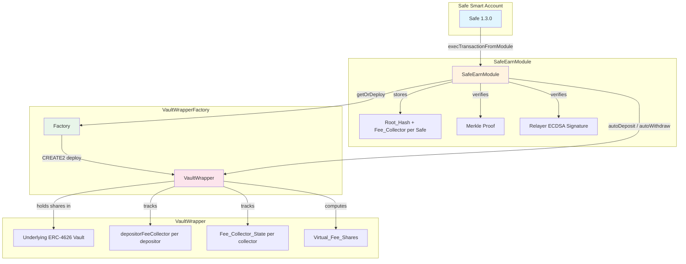
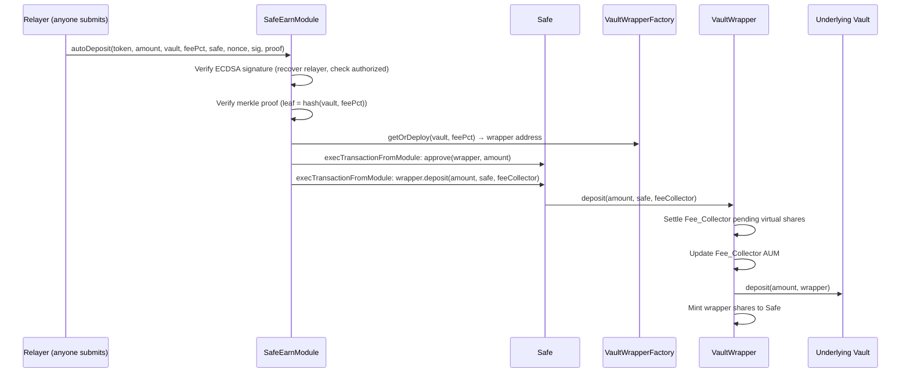
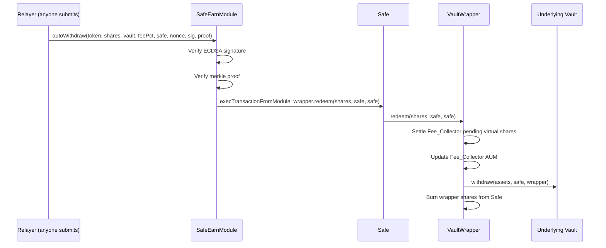

# Design Document: Safe 4626 Vault Module

## Overview

This system consists of three Solidity contracts that enable automated ERC-4626 vault deposits and withdrawals for Gnosis Safe smart accounts, with per-depositor fee tracking via virtual share dilution.

**VaultWrapperFactory** — A singleton factory that deploys VaultWrapper instances via CREATE2. Each unique (underlyingVault, feePercentage) pair maps to exactly one deterministic wrapper address.

**VaultWrapper** — An ERC-4626 compliant middleware vault with non-transferable shares. It sits between depositors and an underlying ERC-4626 vault, tracking per-depositor positions and applying a fixed annual percentage fee via virtual share dilution. Fees accrue per Fee_Collector (not per depositor), and a permissionless `collectFees` function materializes virtual shares and redeems them to the Fee_Collector address.

**SafeEarnModule** — A Safe module that enables relayer-triggered deposits and withdrawals through VaultWrappers. It uses merkle proofs to authorize (underlyingVault, feePercentage) pairs per Safe, ECDSA signatures for relayer authentication with replay protection, and stores a Root_Hash + Fee_Collector per Safe.

The key architectural difference from the v2 reference is the fee model: instead of a global yield-based fee (feeBps on yield), this system uses a fixed annual percentage fee on AUM tracked per Fee_Collector via virtual share dilution. This makes fee accrual predictable and independent of the underlying vault's APY.

## Architecture



### Flow: Deposit



### Flow: Withdrawal



### Fee Model: Virtual Share Dilution

The fee mechanism works by computing "virtual" shares that represent the fee owed to each Fee_Collector. These virtual shares are included in the effective totalSupply, which dilutes the share price for depositors — automatically reflecting the fee in `convertToAssets`.

```
grossAssets = underlying.convertToAssets(underlying.balanceOf(wrapper))
effectiveTotalSupply = realShares + allSettledVirtualShares + allPendingVirtualShares

For a given Fee_Collector:
  pendingVirtualShares = convertToShares(feeCollectorAUM * feePct * elapsed / (10000 * 365.25 days))

convertToAssets(shares) = shares * grossAssets / effectiveTotalSupply
```

When `collectFees(feeCollector)` is called:
1. Settle all pending virtual shares for that Fee_Collector (add to settled total)
2. Mint the settled virtual shares as real ERC20 shares
3. Redeem those shares from the underlying vault
4. Transfer resulting assets to the Fee_Collector address
5. Burn the minted shares, reducing totalSupply back down
6. Reset the settled virtual shares for that Fee_Collector to zero

## Components and Interfaces

### VaultWrapperFactory

```solidity
contract VaultWrapperFactory {
    // Events
    event WrapperDeployed(
        address indexed underlyingVault,
        address indexed wrapper,
        address asset,
        uint256 feePercentage
    );

    // State: salt → deployed wrapper address
    mapping(bytes32 => address) public deployedWrappers;

    /// Deploy or return existing wrapper for (underlyingVault, feePercentage)
    function deploy(
        address underlyingVault,
        uint256 feePercentage
    ) external returns (address wrapper);

    /// Compute deterministic address without deploying
    function computeAddress(
        address underlyingVault,
        uint256 feePercentage
    ) external view returns (address);
}
```

Design decisions:
- The Factory is ownerless and permissionless — anyone can deploy a wrapper.
- Salt = `keccak256(abi.encodePacked(underlyingVault, feePercentage))` ensures uniqueness per pair.
- Fee validation (1–5000 bps) happens in the Factory before deployment.
- The Factory stores deployed addresses in a mapping for O(1) lookup.

### VaultWrapper

```solidity
contract VaultWrapper is ERC20 {
    // Immutables (set in constructor)
    IERC4626 public immutable underlying;
    IERC20 public immutable asset;
    uint256 public immutable feePercentage; // basis points, annual

    // Per-depositor: only stores fee collector assignment
    mapping(address => address) public depositorFeeCollector;

    // Per-Fee_Collector state
    struct FeeCollectorState {
        uint256 totalAUM;              // sum of asset values of depositors assigned here
        uint256 lastAccrualTimestamp;  // last time virtual shares were settled
        uint256 settledVirtualShares;  // accumulated virtual shares ready for collection
    }
    mapping(address => FeeCollectorState) public feeCollectorStates;

    // Global total of all settled virtual shares (for effective totalSupply)
    uint256 public totalSettledVirtualShares;

    // Errors
    error TransfersDisabled();
    error ApprovalsDisabled();
    error ZeroFeeCollector();
    error ZeroAssets();
    error ZeroShares();
    error InsufficientBalance();

    // Events
    event FeeCollectorChanged(address indexed depositor, address indexed oldCollector, address indexed newCollector);
    event FeesCollected(address indexed feeCollector, uint256 virtualShares, uint256 assets);
    event FeeSettled(address indexed feeCollector, uint256 virtualShares);

    // Constructor (called by Factory via CREATE2)
    constructor(address _underlying, uint256 _feePercentage);

    // === ERC-4626 with extended deposit signature ===
    function deposit(uint256 assets, address receiver, address feeCollector) external returns (uint256 shares);
    function mint(uint256 shares, address receiver, address feeCollector) external returns (uint256 mintedShares);
    function withdraw(uint256 assets, address receiver, address owner) external returns (uint256 shares);
    function redeem(uint256 shares, address receiver, address owner) external returns (uint256 assets);

    // === ERC-4626 view functions ===
    function totalAssets() public view returns (uint256);
    function effectiveTotalSupply() public view returns (uint256);
    function convertToShares(uint256 assets) public view returns (uint256);
    function convertToAssets(uint256 shares) public view returns (uint256);
    function maxDeposit(address) external view returns (uint256);
    function maxMint(address) external view returns (uint256);
    function maxWithdraw(address owner) external view returns (uint256);
    function maxRedeem(address owner) external view returns (uint256);
    function previewDeposit(uint256 assets) external view returns (uint256);
    function previewMint(uint256 shares) external view returns (uint256);
    function previewWithdraw(uint256 assets) external view returns (uint256);
    function previewRedeem(uint256 shares) external view returns (uint256);

    // === Fee collection ===
    function collectFees(address feeCollector) external;

    // === View helpers ===
    function getDepositorFeeCollector(address depositor) external view returns (address);
    function getFeeCollectorState(address feeCollector) external view returns (uint256 aum, uint256 settledShares, uint256 pendingShares, uint256 totalClaimableAssets);
    function getPendingVirtualShares(address feeCollector) external view returns (uint256);

    // === Non-transferable overrides ===
    function transfer(address, uint256) public pure override returns (bool);       // reverts
    function transferFrom(address, address, uint256) public pure override returns (bool); // reverts
    function approve(address, uint256) public pure override returns (bool);        // reverts
}
```

Design decisions:
- The `deposit` function takes an extra `feeCollector` parameter beyond standard ERC-4626. The standard 2-arg `deposit(assets, receiver)` is not exposed to prevent deposits without fee collector assignment.
- `effectiveTotalSupply()` returns `totalSupply() + totalSettledVirtualShares + allPendingVirtualShares`. The overridden `totalSupply()` from ERC20 returns only real minted shares. The `convertToAssets`/`convertToShares` functions use `effectiveTotalSupply()` for calculations.
- Virtual shares are computed on-the-fly in O(1) per Fee_Collector using `(AUM * feePct * elapsed) / (10000 * 365.25 days)` then converted to shares.
- Non-transferable shares are enforced by reverting `transfer`, `transferFrom`, and `approve`. Internal `_mint` and `_burn` (from/to zero address) still work.
- Fee settlement happens before any position change (deposit, withdraw, redeem, fee collector rotation) to ensure accurate accounting.

### SafeEarnModule

```solidity
contract SafeEarnModule is Ownable {
    // Constants
    address public constant NATIVE_TOKEN = 0xEeeeeEeeeEeEeeEeEeEeeEEEeeeeEeeeeeeeEEeE;

    // Immutables
    address public immutable wrappedNative;
    VaultWrapperFactory public immutable factory;

    // Per-Safe state
    struct SafeConfig {
        bytes32 rootHash;
        address feeCollector;
    }
    mapping(address => SafeConfig) public safeConfigs;

    // Relayer management
    mapping(address => bool) public authorizedRelayers;

    // Replay protection
    mapping(bytes32 => bool) public executedHashes;

    // Errors
    error NotAuthorized(address caller);
    error ModuleNotInitialized(address account);
    error ModuleAlreadyInitialized(address account);
    error InvalidMerkleProof();
    error InvalidMerkleRoot();
    error InvalidFeeCollector();
    error SignatureAlreadyUsed();
    error CannotRemoveSelf();
    error WrapperNotDeployed();
    error NativeWrapFailed();
    error NativeUnwrapFailed();
    error ApprovalFailed();
    error DepositFailed();
    error RedeemFailed();

    // Events
    event ModuleInitialized(address indexed account);
    event ModuleUninitialized(address indexed account);
    event MerkleRootChanged(address indexed account, bytes32 oldRoot, bytes32 newRoot);
    event AutoDepositExecuted(address indexed safe, address indexed token, address indexed vault, uint256 amount);
    event AutoWithdrawExecuted(address indexed safe, address indexed token, address indexed vault, uint256 shares, uint256 assets);
    event AddAuthorizedRelayer(address indexed relayer);
    event RemoveAuthorizedRelayer(address indexed relayer);

    constructor(
        address _authorizedRelayer,
        address _wrappedNative,
        address _owner,
        address _factory
    );

    // Module lifecycle
    function onInstall(bytes calldata data) external;   // data = abi.encode(rootHash, feeCollector)
    function onUninstall() external;
    function isInitialized(address smartAccount) public view returns (bool);
    function changeMerkleRoot(bytes32 newRoot) external; // callable by Safe only

    // Core operations (signature-based, anyone can submit)
    function autoDeposit(
        address token,
        uint256 amount,
        address underlyingVault,
        uint256 feePercentage,
        address safe,
        uint256 nonce,
        bytes calldata signature,
        bytes32[] calldata merkleProof
    ) external;

    function autoWithdraw(
        address token,
        uint256 shares,
        address underlyingVault,
        uint256 feePercentage,
        address safe,
        uint256 nonce,
        bytes calldata signature,
        bytes32[] calldata merkleProof
    ) external;

    // Relayer management
    function addAuthorizedRelayer(address newRelayer) external;
    function removeAuthorizedRelayer(address relayer) external;
}
```

Design decisions:
- Signature-only auth: unlike the v2 reference which has both direct-call and signature-based overloads, this module uses only signature-based authorization. Anyone can submit the transaction, but the signed message must come from an authorized relayer.
- The signed message includes `chainId, token, amount/shares, underlyingVault, feePercentage, safe, nonce` for full operation specificity.
- Merkle leaf = `keccak256(abi.encodePacked(underlyingVault, feePercentage))` — different fee tiers for the same vault produce different leaves and different wrappers.
- The module stores both `rootHash` and `feeCollector` per Safe. The feeCollector is passed to the VaultWrapper on every deposit.
- The module calls `factory.deploy()` to get-or-deploy the wrapper, then executes approve + deposit/redeem via `execTransactionFromModule`.

## Data Models

### VaultWrapperFactory Storage

| Field | Type | Description |
|-------|------|-------------|
| `deployedWrappers` | `mapping(bytes32 => address)` | Maps CREATE2 salt to deployed VaultWrapper address |

Salt computation: `keccak256(abi.encodePacked(underlyingVault, feePercentage))`

### VaultWrapper Storage

| Field | Type | Description |
|-------|------|-------------|
| `underlying` | `IERC4626` (immutable) | The underlying ERC-4626 vault |
| `asset` | `IERC20` (immutable) | The asset token (= underlying.asset()) |
| `feePercentage` | `uint256` (immutable) | Annual fee in basis points (1–5000) |
| `depositorFeeCollector` | `mapping(address => address)` | Per-depositor fee collector assignment |
| `feeCollectorStates` | `mapping(address => FeeCollectorState)` | Per-fee-collector accrual state |
| `totalSettledVirtualShares` | `uint256` | Global sum of all settled virtual shares |

**FeeCollectorState struct:**

| Field | Type | Description |
|-------|------|-------------|
| `totalAUM` | `uint256` | Sum of asset values of all depositors assigned to this collector |
| `lastAccrualTimestamp` | `uint256` | Timestamp of last virtual share settlement |
| `settledVirtualShares` | `uint256` | Accumulated virtual shares ready for collection |

### SafeEarnModule Storage

| Field | Type | Description |
|-------|------|-------------|
| `wrappedNative` | `address` (immutable) | WETH address |
| `factory` | `VaultWrapperFactory` (immutable) | Factory contract reference |
| `safeConfigs` | `mapping(address => SafeConfig)` | Per-Safe root hash and fee collector |
| `authorizedRelayers` | `mapping(address => bool)` | Authorized relayer addresses |
| `executedHashes` | `mapping(bytes32 => bool)` | Used message hashes for replay protection |

**SafeConfig struct:**

| Field | Type | Description |
|-------|------|-------------|
| `rootHash` | `bytes32` | Merkle root of authorized (vault, feePercentage) pairs |
| `feeCollector` | `address` | Fee collector address for this Safe's deposits |


## Correctness Properties

*A property is a characteristic or behavior that should hold true across all valid executions of a system — essentially, a formal statement about what the system should do. Properties serve as the bridge between human-readable specifications and machine-verifiable correctness guarantees.*

### Property 1: Factory Deploy Idempotence

*For any* (underlyingVault, feePercentage) pair, calling `deploy` twice should return the same wrapper address, and only one contract should be deployed. The second call must not deploy a new contract.

**Validates: Requirements 1.2**

### Property 2: Factory CREATE2 Determinism

*For any* (underlyingVault, feePercentage) pair, `computeAddress(underlyingVault, feePercentage)` should return the exact same address that `deploy(underlyingVault, feePercentage)` returns after deployment. The predicted address must match the actual deployed address.

**Validates: Requirements 1.3, 1.4**

### Property 3: Fee Percentage Validation

*For any* feePercentage value, if feePercentage is 0 or greater than 5000, the Factory's `deploy` function should revert. If feePercentage is in [1, 5000], deployment should succeed.

**Validates: Requirements 4.4**

### Property 4: Deposit Mints Correct Shares

*For any* valid deposit amount and depositor, the number of wrapper shares minted should equal `convertToShares(assets)` computed at the moment before the deposit executes (using the effective total supply that includes virtual fee shares).

**Validates: Requirements 2.3**

### Property 5: Effective Total Supply Invariant

*For any* state of the VaultWrapper, `effectiveTotalSupply()` should equal `ERC20.totalSupply() + totalSettledVirtualShares + sum(pendingVirtualShares for all active feeCollectors)`. This invariant must hold after every deposit, withdrawal, redemption, and fee collection.

**Validates: Requirements 2.7, 4.2**

### Property 6: Non-Transferable Shares

*For any* two non-zero addresses and any uint256 amount, calling `transfer(to, amount)`, `transferFrom(from, to, amount)`, or `approve(spender, amount)` on the VaultWrapper should revert. Only internal mint (from zero address) and burn (to zero address) operations should succeed.

**Validates: Requirements 3.2, 3.3, 3.4**

### Property 7: Virtual Fee Shares Formula

*For any* Fee_Collector with known AUM, feePercentage, and elapsed time since last accrual, the pending virtual fee shares should equal `convertToShares(AUM * feePercentage * elapsed / (10000 * 365.25 days))`. This computation must be O(1) and not require iteration over depositors.

**Validates: Requirements 4.1**

### Property 8: Settlement on Position Change

*For any* deposit, withdrawal, redemption, or fee collector rotation that affects a Fee_Collector, the Fee_Collector's `settledVirtualShares` should increase by the pending virtual shares computed at the time of the operation, and the `lastAccrualTimestamp` should be reset to the current block timestamp.

**Validates: Requirements 4.5, 6.6, 7.4**

### Property 9: Fee Collector Assignment and AUM Tracking

*For any* deposit, the depositor's recorded Fee_Collector should match the provided feeCollector parameter. When a depositor rotates to a new Fee_Collector, the old collector's AUM should decrease by the depositor's asset value and the new collector's AUM should increase by the depositor's updated asset value. When depositing with the same Fee_Collector, the AUM should increase by the new deposit amount.

**Validates: Requirements 5.1, 5.2, 5.3**

### Property 10: Fee Collection Transfers to Collector

*For any* Fee_Collector with accumulated virtual fee shares, calling `collectFees(feeCollector)` from any address should result in assets being transferred exclusively to the feeCollector address. The caller's balance should not change (unless the caller is the feeCollector).

**Validates: Requirements 6.1, 6.2**

### Property 11: Fee Collection Preserves Real Total Supply

*For any* call to `collectFees`, the ERC20 `totalSupply()` (real minted shares, excluding virtual shares) before the call should equal the ERC20 `totalSupply()` after the call, because the minted fee shares are immediately redeemed and burned.

**Validates: Requirements 6.4**

### Property 12: Global Settled Virtual Shares Consistency

*For any* state of the VaultWrapper, `totalSettledVirtualShares` should equal the sum of `feeCollectorStates[fc].settledVirtualShares` across all Fee_Collectors `fc` that have ever been used.

**Validates: Requirements 7.3**

### Property 13: Module onInstall Stores Config

*For any* Safe calling `onInstall` with valid (rootHash, feeCollector) data where rootHash != bytes32(0) and feeCollector != address(0), the module should store both values and `isInitialized(safe)` should return true.

**Validates: Requirements 8.1**

### Property 14: Module changeMerkleRoot

*For any* initialized Safe calling `changeMerkleRoot(newRoot)` where newRoot != bytes32(0), the stored rootHash should be updated to newRoot and the feeCollector should remain unchanged.

**Validates: Requirements 8.5**

### Property 15: Module onUninstall Clears Config

*For any* initialized Safe calling `onUninstall`, the stored rootHash and feeCollector should both be cleared, and `isInitialized(safe)` should return false.

**Validates: Requirements 8.6**

### Property 16: Signature Verification

*For any* autoDeposit or autoWithdraw call, the module should recover the signer from the ECDSA signature and only proceed if the recovered address is in the `authorizedRelayers` mapping. If the recovered signer is not authorized, the call should revert.

**Validates: Requirements 9.2, 9.3, 9.4**

### Property 17: Replay Protection

*For any* valid relayer signature that has been successfully used in an autoDeposit or autoWithdraw call, submitting the same signature a second time should revert with `SignatureAlreadyUsed`.

**Validates: Requirements 9.5, 9.6**

### Property 18: Relayer Management

*For any* address, the contract owner should be able to add it as an authorized relayer (making `authorizedRelayers[addr]` true) and remove it (making it false). An authorized relayer should also be able to add new relayers but cannot remove themselves.

**Validates: Requirements 9.8**

### Property 19: Merkle Proof Verification

*For any* autoDeposit or autoWithdraw call with an invalid merkle proof (one that does not verify against the Safe's stored rootHash for the given leaf), the module should revert with `InvalidMerkleProof`.

**Validates: Requirements 10.2, 10.3, 11.2, 11.3**

### Property 20: Deposit Flow Correctness

*For any* valid autoDeposit call (valid signature, valid merkle proof, initialized Safe), the Safe should receive VaultWrapper shares, the VaultWrapper should hold additional underlying vault shares, and the depositor's fee collector in the wrapper should match the Safe's configured feeCollector.

**Validates: Requirements 10.1, 10.4**

### Property 21: Withdrawal Flow Correctness

*For any* valid autoWithdraw call (valid signature, valid merkle proof, initialized Safe, existing wrapper), the Safe's wrapper share balance should decrease by the redeemed amount, and the Safe's asset token balance should increase by the corresponding asset value.

**Validates: Requirements 11.1, 11.4**

### Property 22: Merkle Leaf Uniqueness

*For any* two (underlyingVault, feePercentage) pairs where either the vault address or the fee percentage differs, the computed merkle leaves `keccak256(abi.encodePacked(underlyingVault, feePercentage))` should be different, ensuring they map to distinct wrapper vaults.

**Validates: Requirements 12.1, 12.3**

### Property 23: Deposit-Withdraw Round Trip

*For any* depositor who deposits assets into a VaultWrapper and immediately withdraws (before any time passes for fee accrual), the returned assets should equal the deposited assets (minus any rounding in the underlying vault's share conversion). The wrapper should not lose or create assets in a zero-time round trip.

**Validates: Requirements 2.2, 2.4**

## Error Handling

### VaultWrapperFactory Errors

| Error | Condition | Description |
|-------|-----------|-------------|
| `InvalidFeePercentage()` | feePercentage == 0 or feePercentage > 5000 | Fee must be 1–5000 bps |
| `InvalidUnderlyingVault()` | underlyingVault == address(0) | Underlying vault cannot be zero address |

### VaultWrapper Errors

| Error | Condition | Description |
|-------|-----------|-------------|
| `TransfersDisabled()` | transfer or transferFrom called with non-zero from and to | Shares are non-transferable |
| `ApprovalsDisabled()` | approve called | Approvals are disabled |
| `ZeroFeeCollector()` | deposit called with feeCollector == address(0) | Fee collector must be set |
| `ZeroAssets()` | deposit/withdraw called with 0 assets | Cannot deposit/withdraw zero |
| `ZeroShares()` | mint/redeem called with 0 shares, or computed shares == 0 | Cannot mint/redeem zero |
| `InsufficientBalance()` | redeem/withdraw called with more shares than owner holds | Owner lacks sufficient shares |

### SafeEarnModule Errors

| Error | Condition | Description |
|-------|-----------|-------------|
| `NotAuthorized(address)` | Recovered signer is not an authorized relayer | Signature from unauthorized address |
| `ModuleNotInitialized(address)` | Safe has no stored rootHash/feeCollector | Module not installed on Safe |
| `ModuleAlreadyInitialized(address)` | onInstall called on already-initialized Safe | Cannot double-initialize |
| `InvalidMerkleProof()` | Proof does not verify against stored root | Unauthorized vault/fee pair |
| `InvalidMerkleRoot()` | rootHash == bytes32(0) in onInstall or changeMerkleRoot | Root hash cannot be zero |
| `InvalidFeeCollector()` | feeCollector == address(0) in onInstall | Fee collector cannot be zero |
| `SignatureAlreadyUsed()` | Message hash already in executedHashes | Replay attack prevention |
| `CannotRemoveSelf()` | Relayer tries to remove themselves | Self-removal not allowed |
| `WrapperNotDeployed()` | autoWithdraw called for vault with no wrapper | Cannot withdraw from non-existent wrapper |
| `NativeWrapFailed()` | WETH wrapping via Safe fails | Safe execution failure |
| `NativeUnwrapFailed()` | WETH unwrapping via Safe fails | Safe execution failure |
| `ApprovalFailed()` | Token approval via Safe fails | Safe execution failure |
| `DepositFailed()` | Deposit via Safe fails | Safe execution failure |
| `RedeemFailed()` | Redeem via Safe fails | Safe execution failure |

### Error Handling Strategy

- All external inputs are validated at the entry point (Factory validates fee range, VaultWrapper validates fee collector, Module validates signatures and proofs).
- Safe `execTransactionFromModule` calls return a boolean — each call is checked and reverts with a descriptive error on failure.
- Virtual share calculations use OpenZeppelin's `Math.mulDiv` with explicit rounding direction to prevent overflow and ensure deterministic rounding.
- The VaultWrapper settles pending virtual shares before any state mutation to prevent stale fee calculations.

## Testing Strategy

### Testing Framework

- **Foundry (forge)** for all Solidity tests
- **forge-std** for test utilities, assertions, and cheatcodes (`vm.prank`, `vm.warp`, `vm.sign`, `deal`)
- **Property-based testing**: Use Foundry's built-in fuzz testing (`function testFuzz_*`) for property-based tests. Foundry's fuzzer generates random inputs and runs each fuzz test for a configurable number of runs.

### Property-Based Testing Configuration

- Each fuzz test should run a minimum of **256 runs** (Foundry default, configurable via `foundry.toml` `[fuzz] runs = 256`)
- Each property test must reference its design document property in a comment tag
- Tag format: `// Feature: safe-4626-vault-module, Property {number}: {property_text}`
- Each correctness property must be implemented by a single fuzz test function

### Unit Tests (Specific Examples and Edge Cases)

Unit tests cover concrete scenarios, edge cases, and integration flows:

- Factory: deploy event emission, deploy with boundary fee values (1, 5000), deploy with invalid fee (0, 5001)
- VaultWrapper: ERC-4626 interface compliance, name/symbol derivation, zero-address fee collector revert, collectFees with zero accumulated shares (no-op), decimals match underlying
- SafeEarnModule: onInstall with zero rootHash revert, onInstall with zero feeCollector revert, double-init revert, autoWithdraw with no wrapper revert, native token wrap/unwrap flows, event emission on deposit/withdraw, constructor sets initial relayer and owner
- Integration: full deposit-then-withdraw flow through module → wrapper → underlying vault

### Property Tests (Fuzz Tests)

Each correctness property (Properties 1–23) maps to a single fuzz test. Key fuzz test categories:

- **Factory properties (P1–P3)**: Fuzz over random vault addresses and fee percentages
- **VaultWrapper share math (P4, P5, P7)**: Fuzz over deposit amounts, time elapsed, AUM values
- **Non-transferable shares (P6)**: Fuzz over random addresses and amounts
- **Fee settlement and collection (P8–P12)**: Fuzz over sequences of deposits, withdrawals, time warps, and fee collections
- **Module lifecycle (P13–P15)**: Fuzz over random root hashes and fee collector addresses
- **Signature and replay (P16–P17)**: Fuzz over random private keys, nonces, and operation parameters
- **Merkle verification (P19, P22)**: Fuzz over random vault/fee pairs and proof arrays
- **End-to-end flows (P20, P21, P23)**: Fuzz over deposit/withdraw amounts with mock underlying vaults

### Test Organization

```
contract/test/
├── VaultWrapperFactory.t.sol      # Factory unit + fuzz tests
├── VaultWrapper.t.sol             # Wrapper unit + fuzz tests (share math, fees, transfers)
├── SafeEarnModule.t.sol           # Module unit + fuzz tests (signatures, merkle, lifecycle)
├── Integration.t.sol              # End-to-end flows (deposit, withdraw, fee collection)
└── mocks/
    └── MockERC4626.sol            # Mock underlying vault for isolated testing
```
